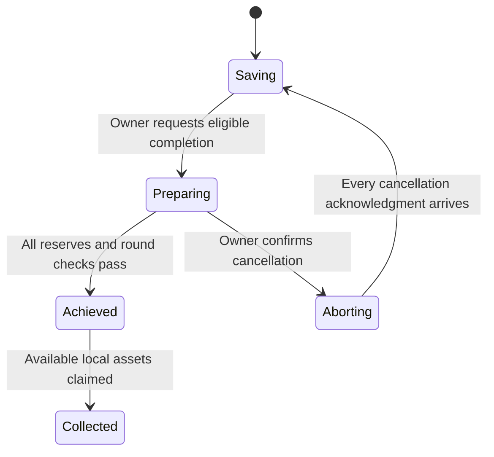

# Completion and Cancellation

Prepare completion becomes available when this goal is fully linked, its own authenticated balance reports are current and consistent, its assets meet the target, and its vaults satisfy the cash preparation conditions. The owner starts the round through the Solana wallet.

The keeper then delivers preparation commands, establishes local readiness, relays participant reports, and records achievement only when the same-round reserves satisfy the goal. Completion messages update the selected EVM vaults. Funds remain on their original chains throughout.

## Why 100% can still show 99 pieces

The savings target and verified achievement are distinct events. A goal can show 100% financial progress while a participant message is still in flight. The final model piece follows verified achievement, and claims additionally require completion to reach the selected vaults.

Even a selected chain holding zero USDC must acknowledge its state. A visible Unlocked label on one chain is not permission to ignore another selected participant. Waiting for chains keeps the claim guard explicit.

## Cancel completion deliberately

Completion options contains Cancel completion. It stops the current completion round and returns the protocol to saving after participant acknowledgments. Cancellation does not withdraw funds, reduce the target, or make an unfinished goal claimable.

Keep verification running when the intention is to finish the goal. Cancelling and immediately preparing again is blocked while acknowledgments are unresolved. Refresh checks state; it does not submit a replacement completion transaction.
