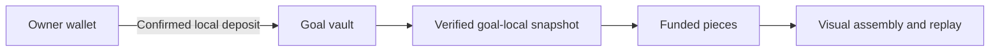

# Deposits and Build Progress

Choose a fully linked goal, select Add savings, choose a selected network and enter the USDC amount. The API verifies the owner, local vault state and wallet balance before issuing an unsigned plan. The wallet confirms the exact transaction.

EVM deposits may require an approval first. Approval gives the goal vault permission for the reviewed amount; it is not itself a deposit. Solana transfers use the goal’s canonical USDC accounts. The app records the original confirmed deposit and separately reads actual vault assets to establish funded progress. An allowance is not a vault balance.

## The construction rule

Funded progress uses this goal’s verified assets and target. Each whole funded percent earns one piece. Before verified achievement, the visible funded count is capped at 99 even when the target is fully funded. After achievement the complete build remains available, including after collection.

The card preview shows exactly the funded part count. The detail workshop separately lets the user assemble or replay those parts. Local animation preferences cannot create a financial deposit, alter a vault balance or unlock a claim.

| Example for a 100-USDC target | Funded presentation |
| --- | --- |
| 0 USDC | Empty studio, 0 funded pieces |
| 25 USDC | 25 funded pieces |
| 100 USDC before verified completion | 100% financial progress, up to 99 funded pieces |
| Verified achievement at 110 USDC | 100 pieces; full 110-USDC amount retained |

The target caps the displayed percentage, not the accounted amount. The application labels over-target savings separately and keeps the full atomic balance available for the eventual validated claim.
