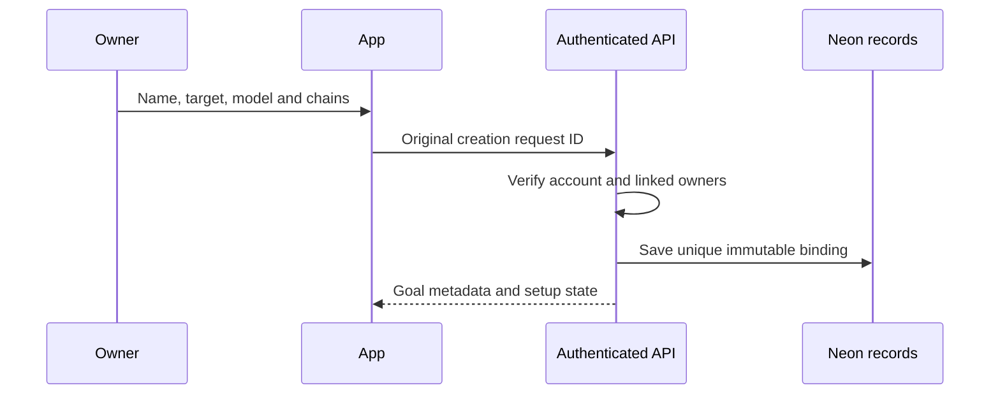

# Goal Creation

The owner chooses New goal in the Dashboard, supplies a name and positive USDC target, selects a model, and chooses Solana plus at least one supported EVM network. A target accepts at most six decimal places, matching USDC’s atomic units.

The API authenticates the Privy account and verifies that the supplied Solana and EVM owners are linked authoritative wallets. It assigns a unique goal ID and stores the name, model, target and derived binding. A request ID makes creation idempotent: repeating the original request must not create a replacement goal.

## Metadata and financial terms

The name and construction template are application metadata. Wallet owners, target, goal ID and selected participant configuration determine the financial commitment. A connected or newly linked wallet does not change the owner of an existing goal.

Creation begins guided provisioning. Saving a metadata record does not prove that any vault exists yet. The app shows a setup state until original creation receipts, Solana initialization and linked participants have been verified.

Each concurrent goal remains independent. A new creation never replaces another goal’s balances, target or in-flight request. Continue with [Vault Setup](vault-setup.md).
