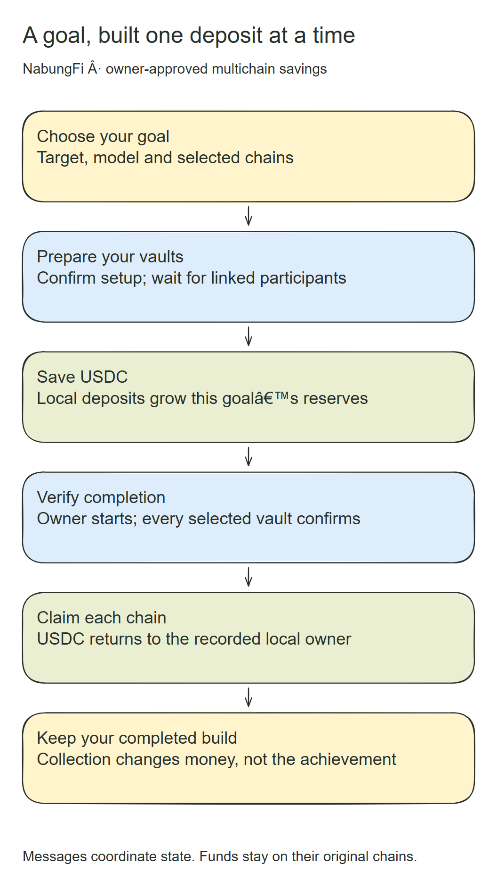
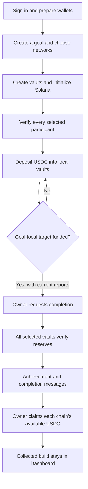

# Overview

A NabungFi goal connects an offchain name and model with an immutable onchain savings binding. The owner creates and funds that goal, while the API verifies receipts and the keeper delivers state-derived coordination messages.

## The complete journey

Money and messages follow different paths. A deposit goes from the owner’s wallet into that chain’s vault. A LayerZero packet communicates state to another participant. A claim returns USDC from the local vault to its owner; it does not automatically consolidate funds into one wallet on another network.

| Stage | Detail |
| --- | --- |
| Define the commitment | [Goal Creation](goal-creation.md) |
| Bind and register participants | [Vault Setup](vault-setup.md) |
| Add money and show progress | [Deposits and Build Progress](deposits-and-progress.md) |
| Establish achievement | [Completion and Cancellation](completion.md) |
| Receive funds and retain history | [Claims and Accounting](claims.md) |
| Resolve uncertain responses | [Transaction Recovery](recovery.md) |
