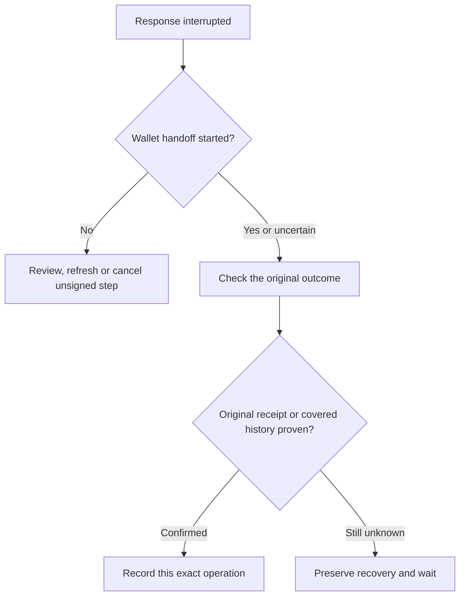

# Transaction Recovery

A closed wallet dialog, expired plan or network timeout does not by itself prove that an operation failed. NabungFi preserves the original goal, action, request ID, plan fingerprint and any returned transaction hash so the outcome can be checked safely.

## Before wallet handoff

An unsigned planned step can be reviewed or cancelled through the authenticated recovery flow. An expired unsigned plan can be refreshed under the same step identity. These actions do not reinterpret an already-started wallet operation as unsubmitted.

## After wallet handoff

Check original transaction looks for the original receipt and its exact action. Explorer, Copy transaction hash and Full transaction hash controls help inspect the reference without changing it. A different action’s receipt is rejected instead of being bound to the request.

For a direct Solana message with no returned signature, bounded finalized-history inspection can prove the original message’s execution or covered expiration without execution. Sponsored messages have different payer and blockhash semantics; an expired original unsigned message is not enough to prove that a sponsored wallet request never executed.

Only select a never-invoked attestation when the wallet truly never reached approval or signing. Unresolved requests also block PWA update activation, so a new release does not interrupt recovery.
