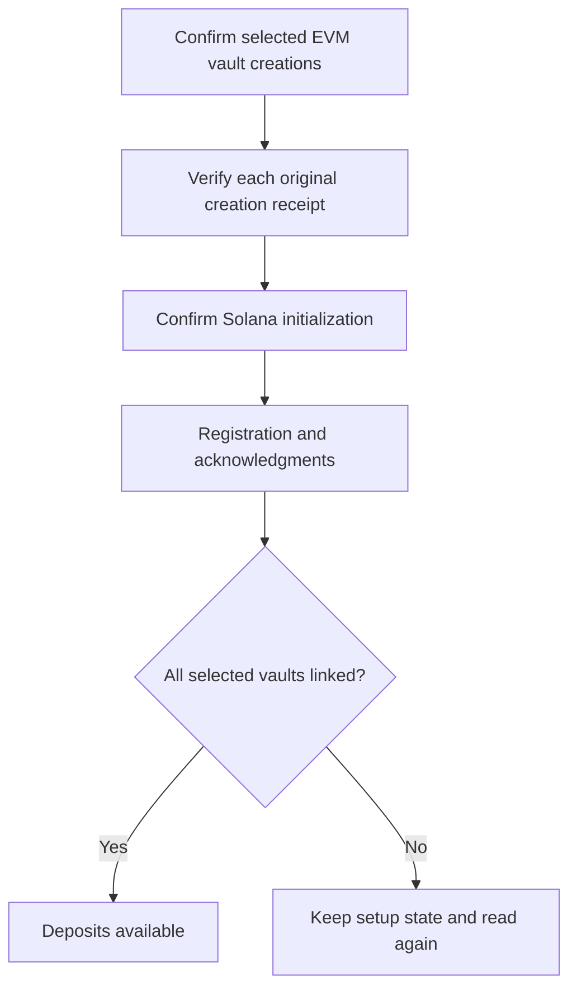

# Vault Setup

Guided setup creates missing EVM vaults one at a time and initializes the Solana goal after the selected EVM identities are known. The owner reviews each unsigned plan and confirms it in the wallet. The API reconciles the original receipt before the app advances.

On EVM, a configured factory creates a dedicated vault for the goal. On Solana, the shared program creates per-goal state and a USDC token account; it does not deploy a new program for every goal.

## Registration is part of readiness

The keeper sends registration and acknowledgment messages through LayerZero. The normal savings view opens only after a fresh snapshot verifies that every selected participant is initialized, registered and linked. A created address alone is not the readiness barrier.

## Pause and resume

Pausing retains metadata, confirmed vaults and original journals. Resume skips verified steps and checks unresolved wallet outcomes before proceeding. A delayed response does not authorize another vault creation or a fresh initialization with a new identity.

Eligible embedded owners can request sponsored testnet gas. Direct external-wallet operations retain their network-fee requirement. Account storage funding and network fees are separate concepts; a displayed sponsor configuration is not a substitute for a confirmed sponsored receipt.

Operational capacity is reserved before owner provisioning begins. If coordination is unavailable, the app preserves the goal and explains the wait instead of beginning paid setup that cannot be serviced.
