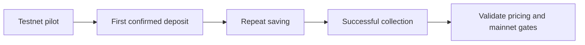

# Roadmap

The roadmap separates the current cash-only testnet application from the work required for a sustained savings product. The phases below are proposed outcomes, not committed launch dates or existing commercial traction.

| Phase | Outcome | Gate before advancing |
| --- | --- | --- |
| Current testnet release | Independent goals, owner-signed deposits and claims, multichain messages, PWA, templates and eligible sponsorship | Recorded chain execution and reproducible source |
| Reliability pilot | Clear first-run onboarding, robust original-request recovery and measured mobile performance | Device testing, supportable failure cases and bounded operation |
| Security and earning research | Reviewed financial invariants, explicit strategy allocation and realizable liquidity | Independent security review and strategy-specific acceptance |
| Mainnet readiness | A separately reviewed deployment and sustainable service | Custody/trust review, operational funding, monitoring and applicable product/legal assessment |

## Initial users and acquisition

Start with crypto users who already hold USDC and want to separate a discretionary purchase goal from spendable wallet funds. Recruit a small testnet pilot through developer communities, hackathon demos and direct product walkthroughs. These are proposed channels; no partnership or customer count is claimed.

The first activation milestone is a real account completing wallet preparation, setting up one goal and making one confirmed deposit. Measure where users stop: sign-in, wallet preparation, network selection, setup, faucet access or the first deposit. A page visit or generated wallet alone is not activation.

## Repeat use and referrals

Track users who return to add another deposit, complete a goal and create a second independent goal. Use interviews to understand whether the construction model makes progress clearer. Invite referrals after a successful collection rather than rewarding users merely for opening a wallet. No retention target is presented as a measured result.

## Commercial model

The current release has no implemented subscription or user-facing platform-fee model. A future business model could test optional paid planning features or transparently disclosed service fees, subject to willingness-to-pay research and contract changes. Gas sponsorship needs a sustainable operator budget; it is not a promise of unlimited free mainnet transactions.

