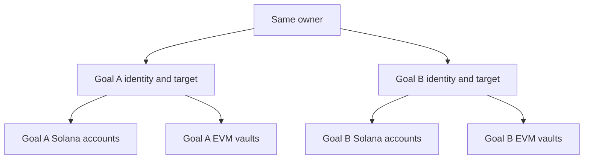

# Smart Contract Architecture

## Solana goal accounts

The shared Anchor core program owns each goal state PDA, derived from the owner and goal ID. A separate SPL USDC cash account is derived from that goal address, with the goal PDA as token authority. Target, owners, principal, claims, completion round, reserved assets and peer state remain goal-local.

Creating a goal allocates accounts; it does not deploy a new executable program. The current state allocation is 824 bytes, including capacity for three EVM participants, and the legacy SPL cash account has 165 bytes. Storage reserves must be queried for the actual account sizes rather than treated as a permanent price quote.

The active interface has no goal/cash-account close instruction. A successful USDC claim therefore does not establish rent reclamation.

## EVM factory and vaults

Each configured network has a router and factory. A factory-created vault binds the owner, USDC asset, goal ID, target, source coordinator and destination domain. The server verifies those fields against the immutable binding before accepting balances or receipts.

Vaults keep principal, realized assets, claimed amounts, phase and round/sequence state separately. Approval and deposit are separate owner actions. Claims require the recorded owner and an achieved lifecycle; an unrelated wallet or another goal’s receipt cannot substitute for either.

## Completion reserves

Preparation freezes a round-specific view of local reserves and participant readiness. The coordinator checks all selected participants, their identities, message sequences and realized aggregate reserves before achievement. Abort acknowledgments prevent a new saving round from silently reusing unresolved prior-round state.

The app release is cash-only. An Arbitrum Aave adapter exists in the repository and has separate fork/source work, but current browser execution does not establish realized earning. Strategy allocation, liquidity and redemption behavior need their own acceptance before a yield feature is offered.
