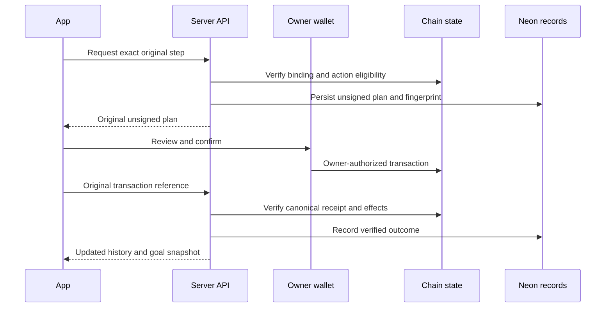

# Data Flow and Indexing

The application reads owner-scoped goal metadata from the API and requests a fresh chain snapshot for each goal. The snapshot validates deployed routes, vault provenance, account ownership, token mint/authority and participant state before reporting balances or eligibility.

## The API is an observer and verifier

Plans describe an exact owner action; they are unsigned. After wallet confirmation, the original transaction hash returns to the reconciliation endpoint. The verifier checks the action, goal, owner, network, exact call/instructions, canonical receipt and token effects. Only then does the request become confirmed in the application history.

## What is indexed offchain

Neon records the app’s goal steps and accepted receipt references. It is not a complete index of every external transfer made by a wallet, and there is no Envio or other separate general chain indexer in this release. The keeper’s private journals track coordination intents rather than replacing owner history.

Concurrent identical reads can share one in-flight result. Settled reads are not retained as a stale authoritative financial cache. A failed read is unavailable; it must not be presented as a fabricated zero or a known subtotal as a complete portfolio.

For sponsored EVM operations, the outer bundler transaction and the user-operation identity differ. Reconciliation binds the precise user operation and its effect, so multiple users sharing an outer transaction do not collide or receive one another’s logs.
