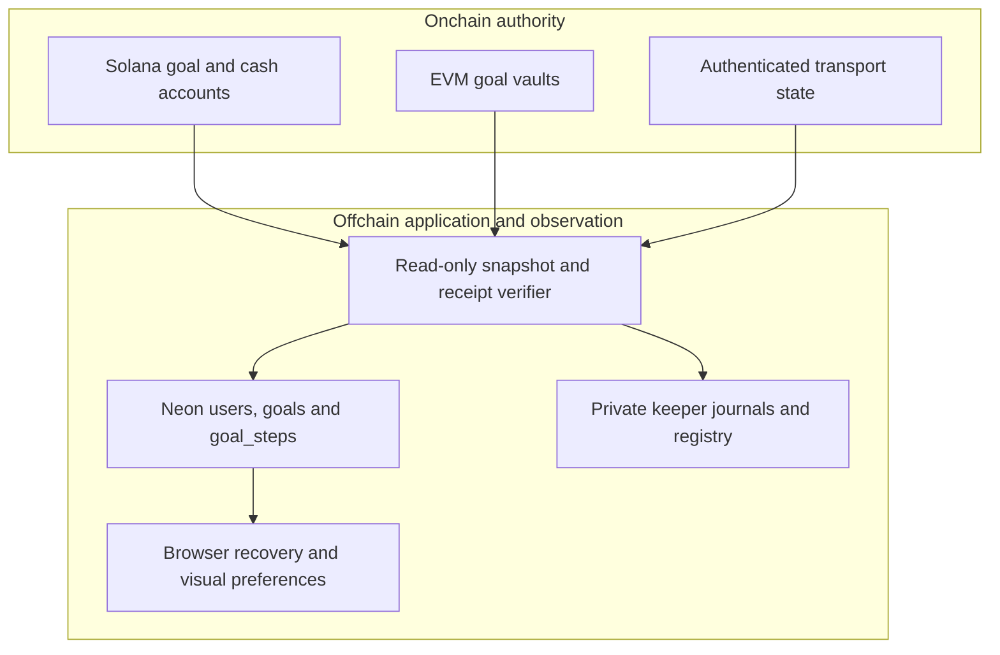

# Onchain and Offchain Data

Contracts are authoritative for funds and lifecycle. The database organizes the user experience and preserves action identities; it cannot make a balance available by changing a row.

## Onchain state

| Store | Authoritative data |
| --- | --- |
| Solana goal state PDA | Owners, goal ID, target, phase, round, readiness, reserves, participant configurations and sequences |
| Solana cash token account | Canonical USDC mint, goal authority and actual local token amount |
| EVM goal vault | Owner, asset, immutable binding, principal, assets, claimed/claimable amounts and lifecycle state |
| Transport/router state | Trusted peers, registered vault identities, packet sequences and durable message records |

## Offchain application records

| Neon table | Purpose |
| --- | --- |
| `nabungfi.users` | Application identity mapped to the verified Privy subject |
| `nabungfi.goals` | Owner-scoped name, template, target, immutable binding and original creation identity |
| `nabungfi.goal_steps` | Original request, action/network, plan fingerprint, transaction reference, receipt and outcome |
| `nabungfi.operator_admissions` | Coordination capacity admission attached to an initialized goal identity |

Migrations add immutable identity guards, owner/network active-wallet lanes, rejected/attempted states and unique verified sponsored user-operation identities. These constraints supplement API checks; they do not replace financial contract rules.

## Offchain copies of chain activity

Accepted receipts are indexed records of observed execution. The keeper stores private original intents, signed wires and budget reservations. Public deployment manifests preserve selected reproducible evidence. Browser storage keeps recovery references and visual preferences; assembly state is optional artwork data.

There is no database-to-custody shortcut in this diagram. Only appropriately authorized chain operations and validated transport messages change the corresponding financial state. Private credentials, bearer tokens and signed wires are not documentation assets.
