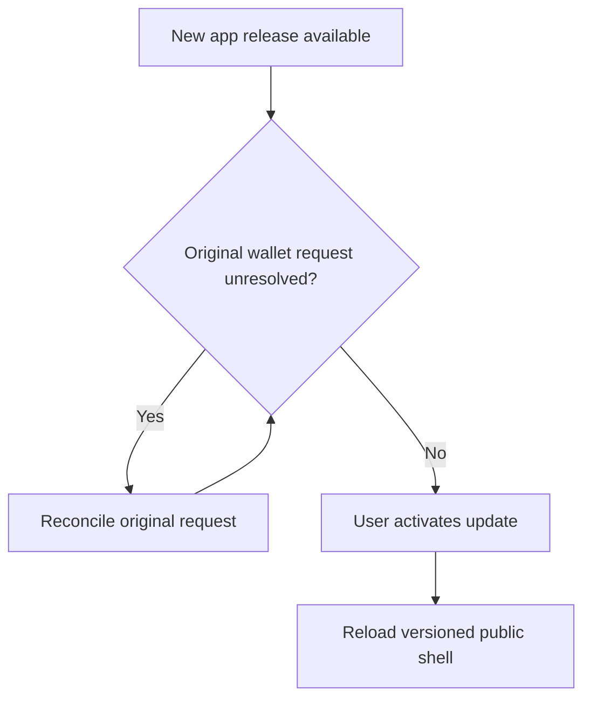

# Frontend and PWA

The React/Vite frontend separates the public landing page from the authenticated app. The landing uses independent rotating build/reverse sculptures; it does not read personal savings or create transactions. The app uses the approved flat block identity for controls and preserves its dimensional goal artwork.

## Funded snapshots and interactive assembly

Dashboard previews are renderer-captured snapshots for each funded part count, so zero is empty and partial construction matches the goal. They load as images, without a WebGL context for every card. Detail models have 100 stable primary parts, funded assembly controls, tilt/rotation, replay and distinct progress/completion audio. Reduced-motion and sound preferences remain separate from financial state.

The complete model is permanent achievement artwork. Replaying it does not recreate a claim or reset a savings commitment. Optional local assembly state is scoped to the goal rather than the portfolio.

## A versioned PWA shell

The manifest supports installation and app navigation on compatible mobile/desktop browsers. The generated worker caches approved public shell assets and lazy wallet modules for the same release. Progress snapshots are cached on demand; it does not download the entire snapshot catalog at installation.

Private authenticated API responses are excluded. Offline mode offers readable cached UI but does not sign, queue or replay financial operations. Updates wait for explicit activation and remain blocked while original wallet requests are unresolved.

Browser reflow, cache behavior and model controls have automated coverage. The current acceptance notes still record mobile 3D performance and maintainability work; a successful build or installable manifest is not universal physical-device acceptance.
