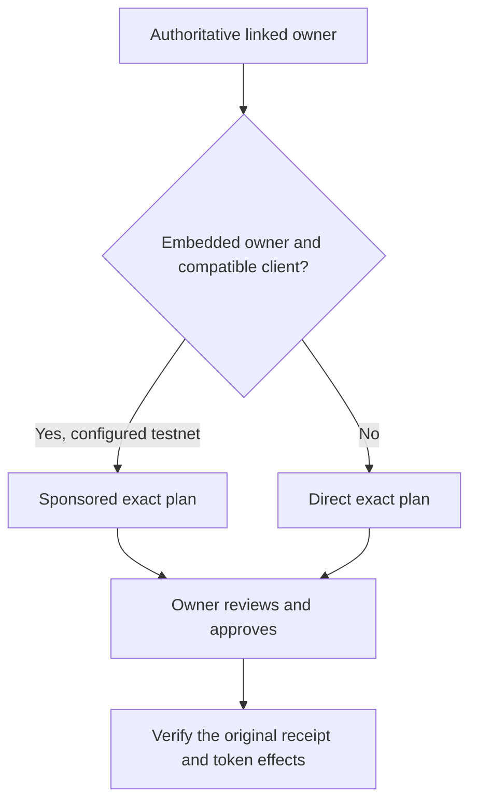

# Identity, Wallets and Sponsorship

Privy authenticates Google, email and wallet sign-in. The custom login flow explicitly prepares missing Ethereum and Solana embedded wallet families and waits for a matching authoritative server session. Restored accounts with missing wallets use the same bounded onboarding path.

## Ownership is not inferred from a connected address

The API obtains linked accounts from authoritative Privy user data. A plan must match the goal’s immutable owner, and the connected provider must match the intended network and address. Linking another wallet does not retarget a saved goal or an unresolved request.

## Sponsored testnet operations

The server selects sponsorship only for an eligible embedded owner with a verified wallet ID, an enabled server capability and a compatible client. External owners retain direct payment. Wallet approval remains visible. Mainnet chains and stablecoin-paid swap sponsorship are outside this configuration.

EVM sponsorship can use a delegated account and ERC-4337 user operation. The verifier binds the supported delegate/EntryPoint envelope, exact call and goal, canonical event and user-operation hash, and the isolated token effects. An outer transaction carrying several users’ operations is not itself a unique owner action.

Solana sponsorship may replace payer/blockhash information or add narrowly bounded account-creation funding. The verifier compares resolved account identities and permissions, ordered instructions and exact data. Only canonical rent funding with explicit native conservation is accepted; unrelated transfers or accounts are rejected.

The 9 October Base + Solana browser run confirmed all eight original sponsored owner operations and unchanged owner native balances. That result is specific to the recorded lifecycle; it does not certify every configured chain/provider or unlimited sponsorship availability.
