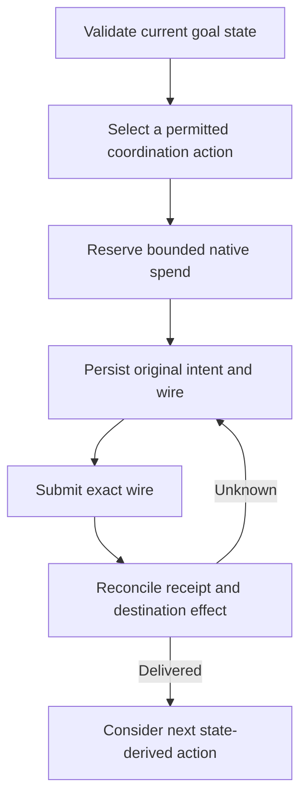

# Keeper Automation

The keeper runs separately from the authenticated API. It validates existing goal bindings, publishes registration and progress messages, delivers pending commands/reports, establishes local readiness and advances verified achievement. Permissionless application mode uses owner-initiated preparation; it does not automatically start a completion round for the user.

## What the keeper cannot do

It does not create owner goals, approve or deposit user USDC, allocate an earning strategy, claim savings or change targets. Its coordination authority and native fee-payer resources are separate from each goal’s financial owner.

## Durable intent before submission

An action is identified by its goal, kind, domain, round and sequence. The journal persists the exact intended action and signed wire before broadcasting. Restart checks the original signature/hash and the application’s destination state. Unknown outcomes retain their original identity; the worker does not blindly choose a new nonce or blockhash.

The private registry admits receipt-verified initialized goals and retains accepted identities. API admission reserves operating capacity before provisioning. Per-network reserves, daily budgets, gas/message caps and action limits bound the service; they do not make a compromised signer harmless or guarantee unlimited capacity.

The API and keeper run as separate native services on the server. Hosted availability, funding and unresolved-message monitoring remain operational dependencies. The public cash lifecycle evidence proves particular executions, not permanent uptime.
