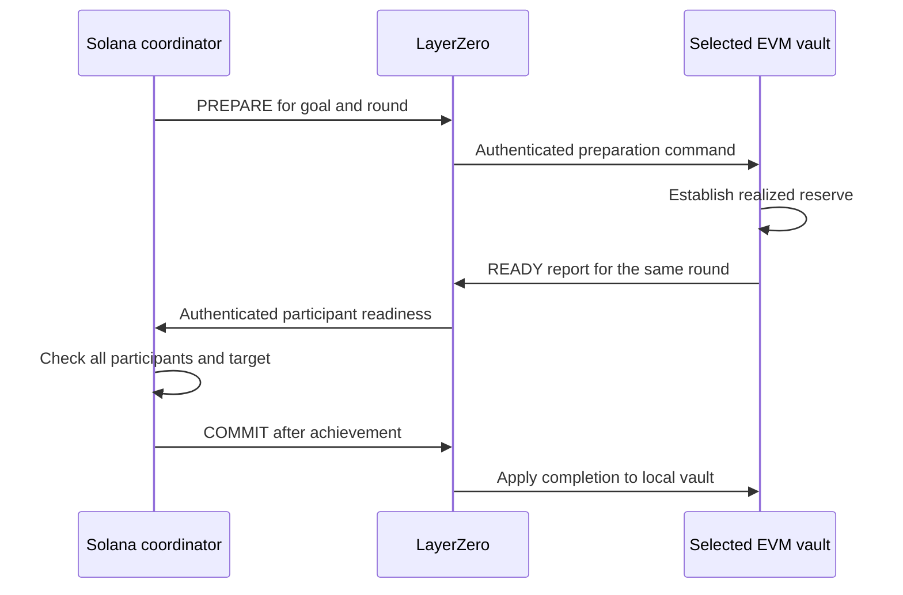

# LayerZero Coordination

The Solana transport OApp and EVM routers bind the configured domains, endpoint IDs and trusted peers. Packets identify the goal, configuration, source/destination, lifecycle round and sequence. A receiving component validates that context before applying a report or command.

## Registration and progress

Registration establishes the selected peer identities. Linked acknowledgments make the goal ready for deposits. Absolute balance reports then describe each peer’s current net assets, with authenticated sequence and receipt-time information. Preparation requires current reports that match the actual goal positions.

## A coordinated completion round

A source transaction, transport submission, verified packet and destination execution are different events. The public four-chain browser run recorded 103 distinct delivered packets separately from its 51 owner transactions. That dated evidence does not imply a transport latency guarantee.

## Message safety and delivery limits

Participant configuration, goal identity, round and sequence checks prevent unrelated or stale messages from being interpreted as current readiness. Durable outboxes retain predecessor commands and reports so cancellation can be delivered in order even when preparation was already in flight.

The current testnet setup uses a required DVN and retained transport/program administration boundaries recorded in the deployment manifests. Those dependencies belong in the [trust model](trust.md); application UI success does not remove them.
