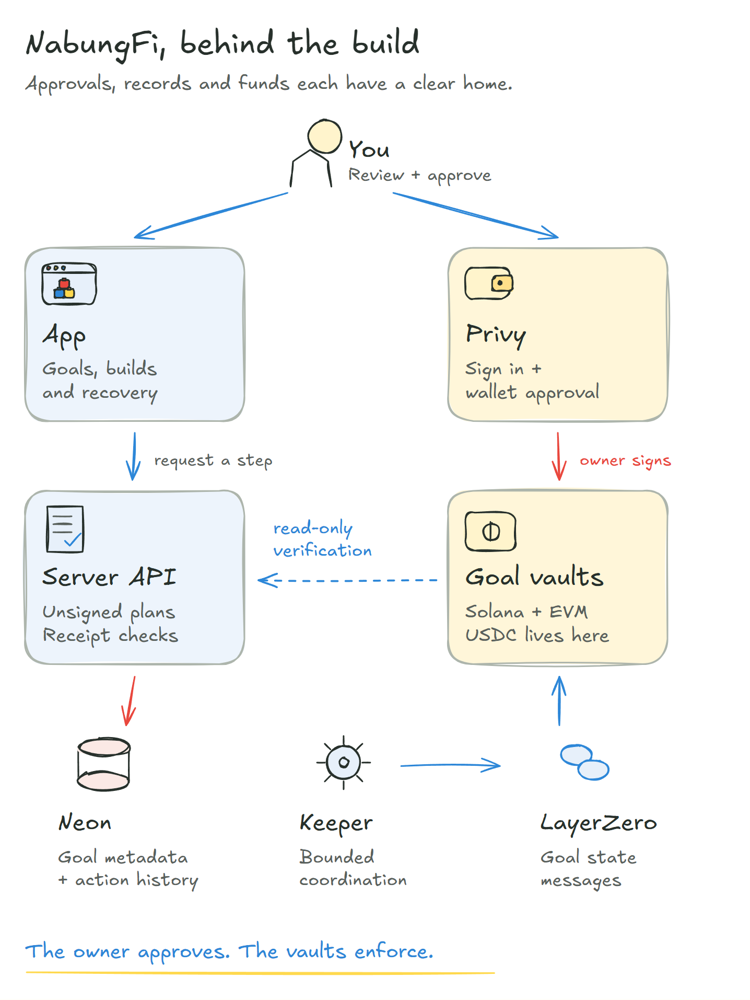
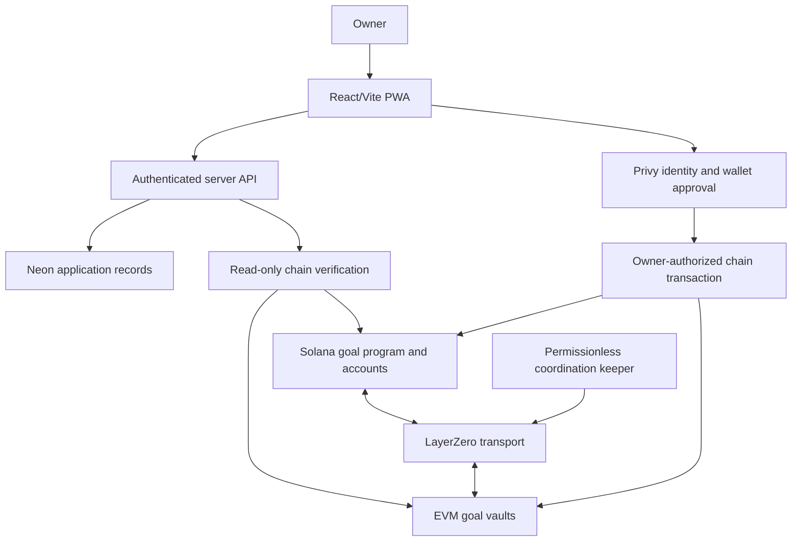

# Overview

NabungFi separates wallet authorization, financial execution, application records and message coordination. The browser presents the goal and asks the owner to review actions. The API authenticates the account, issues exact unsigned plans and reconciles original receipts. Contracts enforce custody, identity, lifecycle and claims. The keeper services bounded state-derived messages without becoming the financial owner.

## Read the boundaries in detail

| Component or boundary | Page |
| --- | --- |
| Goal accounts and factories | [Smart Contract Architecture](architecture.md) |
| Authenticated packets and participant sequencing | [LayerZero Coordination](layerzero.md) |
| Durable, bounded automation | [Keeper Automation](keeper.md) |
| Read models and receipt acceptance | [Data Flow and Indexing](data-flow.md) |
| Authoritative state and stored records | [Onchain and Offchain Data](data-storage.md) |
| Authenticated server responsibilities | [API and Application Data](api.md) |
| Wallet identity and sponsor envelopes | [Identity, Wallets and Sponsorship](identity-and-gas.md) |
| Construction, cache and update behavior | [Frontend and PWA](frontend-and-pwa.md) |
| Permissions and remaining trust | [Authorization and Trust Boundaries](trust.md) |

Public chain configuration and addresses are centralized under [Chains](../deployments/chains.md). Source and evidence links identify the applicable testnet release; successful source compilation is not a claim of independent security review.
